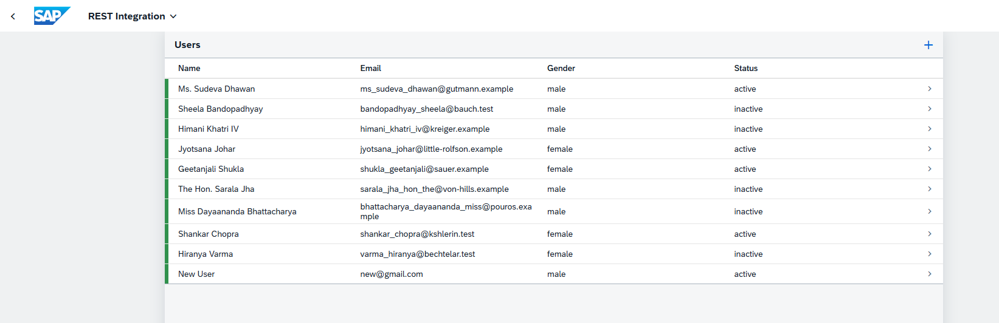

# OData CRUD

A modern SAP Fiori-style User Management application built with SAP UI5 MVC architecture and consuming data from an OData service.

The app allows users to view, add, edit, and delete user records, showcasing key SAP UI5 enterprise features

## Tech Stack

• SAP UI5 / Fiori

• JavaScript (ES6)

• XML Views (HTML5)

• OData Model (remote data source)

• UI5 Routing & Fragments

## Why This Project

This project demonstrates my ability to build enterprise-grade SAP Fiori applications. By working with OData services, MVC architecture, and advanced UI5 patterns like routing and data binding, I gained practical experience in managing real-world enterprise workflows and preparing scalable solutions for business applications.

## Screenshot: SAP Fiori Request Manager



## Setup instructions

1️⃣ Clone the Repository git clone cd

2️⃣ Install Node.js (if not installed)

Download Node.js (LTS) from https://nodejs.org

Verify:

node -v npm -v

## Build for Production

```bash
npm run build
or
npm start


Opens the app in your browser:

http://localhost:8080
```
